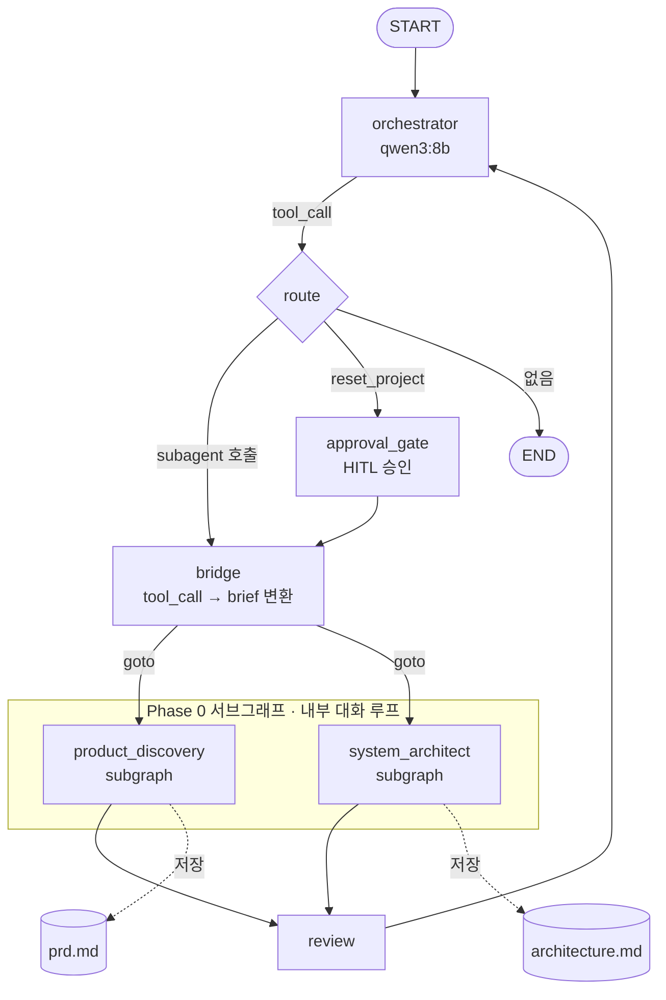

# YourAiWorkforce — 로컬 8B LLM 멀티에이전트 오케스트레이션

> **한 줄 요약**: API 비용 0원으로, 16GB 맥북에서 도는 확률적인 8B 로컬 모델을
> **신뢰 가능할 만큼 결정론적으로 길들여** 만든 멀티에이전트 기획 파이프라인.
> 대표의 러프한 아이디어 → 구조화된 산출물(PRD + 아키텍처 문서).

[LangGraph](https://langchain-ai.github.io/langgraph/) `StateGraph` 위에 오케스트레이터 하나가
전문 서브에이전트에게 일을 위임하고, 각 단계마다 사람이 승인(HITL)하는 구조입니다.
모든 추론은 [Ollama](https://ollama.com) 로컬 모델(`qwen3:8b`, `deepseek-r1:8b`)로 수행되어
**외부 API 호출·비용·데이터 유출이 전혀 없습니다.**

---

## 왜 이 프로젝트인가

상용 API(GPT-4, Claude)를 쓰면 멀티에이전트는 "쉽게" 돕니다. 대신 그건 모델이 잘하는 것이고,
엔지니어링 서사가 없습니다. 이 프로젝트는 정반대 제약에서 출발합니다:

- **8B 로컬 모델은 확률적으로 지시를 어긴다.** 페르소나에 "PM이라고 자칭하지 마"라고 써도 자칭하고,
  "1턴에 저장 도구 부르지 마"라고 써도 부르고, thinking 토큰을 응답에 흘립니다.
- **그래서 "모델을 믿는" 대신 "시스템으로 조인다".** 별도 critic 모델, 저장 검증 게이트,
  응답 후처리, 상태 격리 — 확률적 컴포넌트를 결정론적 래퍼로 감싸는 게 이 저장소의 핵심입니다.

> 📌 **현재 완성 범위**: **Phase 0**(아이디어 → PRD → 아키텍처)이 E2E로 동작합니다.
> [`agents/`](agents/)에는 Phase 1~6(구현/QA/배포)까지의 에이전트 페르소나 설계가 있으나,
> **코드로 배선된 것은 Phase 0**이며 나머지는 로드맵입니다 ([아래 참고](#구현-현황-vs-로드맵)).

---

## 아키텍처



- **orchestrator**: 대화를 받아 어떤 서브에이전트에게 위임할지 tool-call로 결정. `qwen3:8b`.
- **bridge**: orchestrator의 tool-call을 서브에이전트용 brief(HumanMessage)로 변환하고
  `Command(goto=...)`로 라우팅. LangGraph의 **subgraph-as-node** 메커니즘을 그대로 써서
  서브에이전트의 `interrupt`가 부모로 자동 전파되고 `resume` 값도 자동 전달됩니다.
- **phase-0 서브그래프**: `product_discovery`(→ PRD), `system_architect`(→ 아키텍처 문서).
  각각 `model → save → check_done → wait_for_user` 내부 루프를 도는 **대화형 서브그래프**.
- **review / approval_gate**: 산출물 리뷰 후 오케스트레이터로 복귀, 위험 작업은 사람이 승인.

주요 소스: [src/agent.py](src/agent.py) (그래프 조립),
[src/libs/subgraph.py](src/libs/subgraph.py) (대화형 서브그래프 빌더),
[src/subagents/planners/](src/subagents/planners/) (phase-0 에이전트).

---

## 해결한 하드 프러블럼

각 항목은 코드/트레이스에 근거가 있고, 설계 회고는 별도 블로그 시리즈
[**LangGraph 멀티에이전트 시리즈**](https://bswebdev.hashnode.dev/series/lang-graph)에 정리했습니다.

### 1. 서브에이전트 간 상태 오염 → State 격리
공유 `state["messages"]`에서 오케스트레이터의 핸드오프 메시지·tool_call이 플래너의 LLM 입력으로
새어 들어가, 플래너가 자기를 PM으로 자칭하는 일이 발생했습니다. 서브에이전트를 별도
`SubagentState`로 분리하고, `finalize` 단계에서 `RemoveMessage`로 경계를 그어 부모 메시지 오염을
차단했습니다. → [src/subagents/state.py](src/subagents/state.py) · [libs/subgraph.py](src/libs/subgraph.py)

### 2. subgraph resume가 매번 처음부터 다시 시작
서브그래프에 checkpointer가 전달되지 않아, 사용자 답변이 messages에서 사라지고 대화가 1턴으로
리셋됐습니다. checkpointer를 서브그래프까지 일관되게 주입하고, FastAPI(Async)와
`langgraph dev`가 **같은 sqlite 파일을 공유**하도록 맞췄습니다.
→ [src/agent.py:170](src/agent.py#L170)

### 3. `langgraph dev`의 sync I/O 차단(blockbuster)
dev 미들웨어가 핸들러 내부의 동기 I/O를 막아 SqliteSaver 연결이 실패했습니다.
`graph()` 호출 시점이 아니라 **모듈 로드 시점**에 sqlite 연결을 만들어 이벤트 루프 밖에서
처리하도록 우회했습니다. → [src/agent.py:150](src/agent.py#L150)

### 4. 확률적 8B를 결정론적으로 — 완료 판정 분리
`check_done`(YES/NO 판정)을 플래너(temp=0.5, 발산적)가 하면 오판정이 났습니다.
동일 모델 파일이지만 **temp=0 별도 critic 인스턴스**를 주입하고 thinking 토큰을 strip해
완료 판정을 결정론화했습니다. → [product_discovery/__init__.py](src/subagents/planners/product_discovery/__init__.py)

### 5. 저장 검증 게이트 & 응답 후처리
- `_validate_prd`: 필수 섹션 존재 + placeholder 잔존 여부를 검사해 **미완성 산출물 저장을 차단**.
- 응답 후처리: `<think>` 블록, `🛑 [턴 종료]` 마커, 빈 코드펜스, 2턴 이후 인사 prefix를 정규식으로 제거.
- `_sanitize_query`: 오케스트레이터가 query에 "대표님!" 같은 호칭을 환각하는 걸 명사구로 정규화.
→ [src/libs/subgraph.py](src/libs/subgraph.py)

### 6. 저장 도구 숨기기 (dynamic tool binding)
"1턴엔 저장하지 마"라고 지시해도 모델이 어겨서, **저장 도구 자체를 조건부로 bind**해
물리적으로 호출 불가능하게 만들었습니다. → [libs/subgraph.py](src/libs/subgraph.py) (`model_with_save`)

### 7. 모델 선정 로그
`gemma4:e4b`(4B)가 한국어 negative-instruction 추종에 실패한 과정을 LangSmith 트레이스 근거와 함께
기록하고 `qwen3:8b`로 이전한 결정 기록. → [docs/plan/model-use.md](docs/plan/model-use.md)

---

## 기술 스택

| 레이어 | 기술 |
|--------|------|
| 오케스트레이션 | LangGraph (`StateGraph`, subgraph-as-node, `interrupt`/`Command`) |
| LLM 런타임 | Ollama (로컬) — `qwen3:8b`(orchestrator/planner), `deepseek-r1:8b`(critic 후보) |
| 서빙 | FastAPI (ASGI) + `langgraph dev` |
| 상태 | SqliteSaver checkpointer (Async/Sync 파일 공유) |
| 관측 | LangSmith 트레이싱 |
| 패키징 | uv, Docker / docker-compose |

---

## 실행

```bash
# 1. 로컬 모델 준비 (Ollama 설치 필요)
ollama pull qwen3:8b
ollama pull deepseek-r1:8b

# 2. 환경변수
cp .env.example .env    # LANGSMITH_API_KEY, MODEL_BASE_URL 등 채우기

# 3. 개발 서버
uv sync
uv run uvicorn src.main:app --reload
# 또는 LangGraph Studio: uv run langgraph dev

# 4. (선택) 컨테이너
docker-compose up --build
```

---

## 구현 현황 vs 로드맵

이 저장소는 **Phase 0을 "완성된 제품"으로** 좁혀서 깊이를 확보하는 전략을 택했습니다.
8B 로컬 모델의 코드 생성 능력 한계상, Phase 1~6(실제 코드 생성)까지 벌리면
"야심차지만 안 도는 데모"가 되기 때문입니다.

| 범위 | 상태 |
|------|------|
| Phase 0 — Product Discovery (아이디어 → PRD) | ✅ 코드 배선 완료 |
| Phase 0 — System Architect (PRD → 아키텍처) | ✅ 코드 배선 완료 |
| 오케스트레이터 라우팅 · HITL 승인 게이트 · 상태 격리 | ✅ 코드 배선 완료 |
| Phase 1~6 (구현/QA/보안/배포 에이전트) | 📐 페르소나 설계만 존재 ([agents/](agents/)) · 로드맵 |
| Go 게이트웨이 (SSE 스트리밍 BFF) · 스트리밍 웹 UI | 🚧 계획 |

---

## 라이선스

[MIT](LICENSE)
