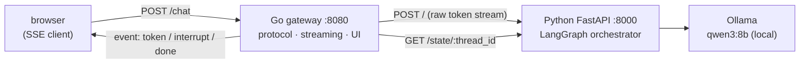

# YourAiWorkforce — a local-8B multi-agent pipeline, clamped for trust and squeezed for cost

> **In one line**: a multi-agent planning pipeline that turns a *stochastic, slow* 8B local model
> into something *reliable and cheap enough to actually use* — running entirely on a 16GB MacBook at
> **zero API cost**. A founder's rough idea → structured artifacts (PRD + architecture doc).

One orchestrator routes work to specialist subagents. A human approves each step. Every model call
runs on a local [Ollama](https://ollama.com) model — Phase 0 runs entirely on `qwen3:8b` (orchestrator,
planner, and a temp=0 critic instance) — no API, no cost, nothing leaves the machine.

It's built on [LangGraph](https://langchain-ai.github.io/langgraph/) `StateGraph`, and the whole
design follows one rule I kept relearning the hard way: **prompt is suggestion, graph is law.**

---

## Why this project

With a commercial API (GPT-4, Claude), multi-agent systems "just work" — the *model* does the
heavy lifting and there's no engineering story in it. This project starts from the opposite
constraint: a small local model that is both **unreliable** and **expensive to run**, on a 16GB
machine. Two problems, two pillars — and the whole repo is those two shells:

- **Clamp — for reliability.** An 8B model breaks instructions probabilistically: tell the persona
  "don't call yourself the PM" and it does; tell it "don't save on turn 1" and it does; it leaks
  thinking tokens into replies. So instead of *trusting* the model, I *clamp* it — a separate critic,
  a save-validation gate, response post-processing, state isolation: each probabilistic component
  wrapped in a **deterministic** shell.
- **Squeeze — for efficiency.** On-device, every discarded token is wall-clock and every context
  window is RAM. So I don't guess, I measure and cut: instrument every model call, size `num_ctx`
  per role, kill reasoning where it buys nothing. One measured result — the done-check dropped from
  ~25s to ~0.3s at matched accuracy, because prompt design beat inference-time compute. Each
  component wrapped in a **cheap** shell. → [docs/metrics/](docs/metrics/)

> 📌 **Current scope**: **Phase 0** (idea → PRD → architecture) works end-to-end.
> [`agents/`](agents/) contains persona designs through Phase 1–6 (build / QA / deploy), but
> **only Phase 0 is wired in code** — the rest is roadmap ([see below](#implementation-status-vs-roadmap)).

---

## Architecture

Two services. The Go gateway owns the **client-facing protocol**; the Python service owns the
**graph**. The split is not cosmetic — see [why the gateway exists](docs/engineering-notes.md#8-the-python-stream-never-says-why-it-ended).



Inside the Python service, the graph itself:


- **orchestrator**: takes the conversation and decides which subagent to delegate to, via a
  tool-call. Runs `qwen3:8b`.
- **bridge**: converts the orchestrator's tool-call into a brief (HumanMessage) for the subagent
  and routes with `Command(goto=...)`. It uses LangGraph's **subgraph-as-node** mechanism directly,
  so a subagent's `interrupt` propagates to the parent automatically and the `resume` value flows
  back in automatically.
- **phase-0 subgraphs**: `product_discovery` (→ PRD) and `system_architect` (→ architecture doc).
  Each is a **conversational subgraph** cycling through an internal
  `model → save → check_done → wait_for_user` loop.
- **review / approval_gate**: returns to the orchestrator after reviewing an artifact; risky
  actions require human approval.

Key source: [src/agent.py](src/agent.py) (graph assembly),
[src/libs/subgraph.py](src/libs/subgraph.py) (conversational subgraph builder),
[src/subagents/planners/](src/subagents/planners/) (phase-0 agents).

---

## Engineering highlights

The harder problems this project turned on — **clamping** the model for reliability, **squeezing** it
for cost, and the **system** built around both. Full write-ups, code, and traces →
**[docs/engineering-notes.md](docs/engineering-notes.md)**.

- **Squeeze · a deterministic done-check, then measured** — a temp=0 critic with reasoning off and a
  safety-biased prompt matches thinking-mode accuracy at ~48× lower latency; prompt design beat
  inference-time compute, proven with a per-call instrumentation harness ([numbers](docs/metrics/)).
- **Clamp · state isolation across a subgraph boundary** — strip a subagent's internal turns from the
  parent thread with `RemoveMessage`, while keeping LangGraph's native interrupt propagation.
- **Clamp · making an illegal action impossible** — dynamic tool binding so the model physically
  *can't* call `save` before it's allowed, instead of asking it not to.
- **System · reconstructing why the stream ended** — the Python token stream is byte-identical whether
  a turn finished or paused for approval, so the Go gateway makes a second state call and emits
  explicit `interrupt`/`done` events. The load-bearing reason the gateway exists.

---

## Tech stack

| Layer | Tech |
|-------|------|
| Orchestration | LangGraph (`StateGraph`, subgraph-as-node, `interrupt`/`Command`) |
| LLM runtime | Ollama (local) — `qwen3:8b` for all Phase 0 roles (`deepseek-r1:8b` evaluated as critic, rejected — see [model log](docs/plan/model-use.md)) |
| Serving | FastAPI (ASGI) + `langgraph dev` |
| Gateway / BFF | Go (stdlib only — `net/http`, goroutines, `context`, `embed`) |
| Client protocol | SSE — `token` / `interrupt` / `done` / `error` (designed at the gateway) |
| State | SqliteSaver checkpointer (async/sync file sharing) |
| Observability | LangSmith tracing |
| Efficiency | per-call instrumentation harness + labeled eval → [docs/metrics/](docs/metrics/) |
| Packaging | uv, Docker / docker-compose |

---

## Running it

```bash
# 1. Pull the local model (Ollama required) — Phase 0 runs entirely on qwen3:8b
ollama pull qwen3:8b

# 2. Environment variables
cp .env.example .env    # fill in LANGSMITH_API_KEY, MODEL_BASE_URL, etc.

# 3. Python orchestrator (port 8000)
uv sync
uv run uvicorn src.main:app --port 8000
# or LangGraph Studio: uv run langgraph dev

# 4. Go gateway + web UI (port 8080)
cd gateway && go run .
# then open http://localhost:8080
# override the upstream with UPSTREAM_BASE (default: http://localhost:8000)

# 5. (optional) containers
docker-compose up --build
```

---

## Implementation status vs roadmap

This repo deliberately narrows scope to **Phase 0 as a "finished product"** to gain depth. Given
the code-generation ceiling of an 8B local model, stretching all the way to Phase 1–6 (actual code
generation) would produce an "ambitious but non-working demo".

| Scope | Status |
|-------|--------|
| Phase 0 — Product Discovery (idea → PRD) | ✅ wired in code |
| Phase 0 — System Architect (PRD → architecture) | ✅ wired in code |
| Orchestrator routing · HITL approval gate · state isolation | ✅ wired in code |
| Phase 1–6 (build/QA/security/deploy agents) | 📐 persona designs only ([agents/](agents/)) · roadmap |
| Go gateway — SSE relay of the `interrupt`/`resume` protocol | ✅ wired in code ([gateway/](gateway/README.md)) |
| Go gateway — thin streaming web UI | ✅ wired in code ([gateway/static/](gateway/static/)) |
| Go gateway — session management · artifact-serving API | 🚧 planned |

**See it actually run** → [docs/samples/](docs/samples/) holds a real, unedited PRD generated
end-to-end by the `product_discovery` agent (with the model's rough edges left in, documented honestly).

---

## How this was built

Pair-programmed with [Claude Code](https://claude.com/claude-code). The architecture, the
decisions, and the trade-offs documented here are mine; much of the implementation was AI-assisted.

## License

**All rights reserved.** This repository is public for portfolio/demonstration purposes only —
you may read the source to evaluate the work, but no license is granted to reuse, copy, modify, or
redistribute it. See [LICENSE](LICENSE).
