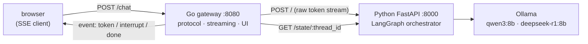
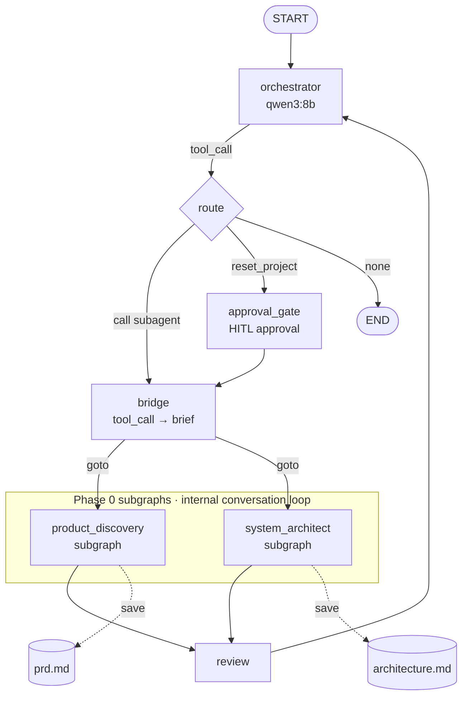

# YourAiWorkforce — Local 8B LLM Multi-Agent Orchestration

> **In one line**: a multi-agent planning pipeline that tames a *stochastic* 8B local
> model into behaving *deterministically enough to trust* — running entirely on a 16GB
> MacBook at **zero API cost**. A founder's rough idea → structured artifacts (PRD + architecture doc).

One orchestrator routes work to specialist subagents. A human approves each step. Every model call
runs on a local [Ollama](https://ollama.com) model (`qwen3:8b`, `deepseek-r1:8b`) — no API, no cost,
nothing leaves the machine.

It's built on [LangGraph](https://langchain-ai.github.io/langgraph/) `StateGraph`, and the whole
design follows one rule I kept relearning the hard way: **prompt is suggestion, graph is law.**

---

## Why this project

With a commercial API (GPT-4, Claude), multi-agent systems "just work" — but that's the
*model* doing the heavy lifting, and there's no engineering story in it. This project starts
from the opposite constraint:

- **An 8B local model breaks instructions probabilistically.** Tell the persona "don't call
  yourself the PM" and it does; tell it "don't call the save tool on turn 1" and it does;
  it leaks thinking tokens into its replies.
- **So instead of *trusting* the model, I *clamp* it.** A separate critic model, a save-validation
  gate, response post-processing, state isolation — wrapping each probabilistic component in a
  deterministic shell is the core of this repo.

> 📌 **Current scope**: **Phase 0** (idea → PRD → architecture) works end-to-end.
> [`agents/`](agents/) contains persona designs through Phase 1–6 (build / QA / deploy), but
> **only Phase 0 is wired in code** — the rest is roadmap ([see below](#implementation-status-vs-roadmap)).

---

## Architecture

Two services. The Go gateway owns the **client-facing protocol**; the Python service owns the
**graph**. The split is not cosmetic — see [hard problem #8](#8-the-python-stream-never-says-why-it-ended).



Inside the Python service, the graph itself:



- **orchestrator**: takes the conversation and decides which subagent to delegate to, via a
  tool-call. Runs `qwen3:8b`.
- **bridge**: converts the orchestrator's tool-call into a brief (HumanMessage) for the subagent
  and routes with `Command(goto=...)`. It uses LangGraph's **subgraph-as-node** mechanism directly,
  so a subagent's `interrupt` propagates to the parent automatically and the `resume` value flows
  back in automatically.
- **phase-0 subgraphs**: `product_discovery` (→ PRD) and `system_architect` (→ architecture doc).
  Each is a **conversational subgraph** cycling through an internal
  `model → save → check_done → wait_for_user` loop.
- **review / approval_gate**: returns to the orchestrator after reviewing an artifact; risky
  actions require human approval.

Key source: [src/agent.py](src/agent.py) (graph assembly),
[src/libs/subgraph.py](src/libs/subgraph.py) (conversational subgraph builder),
[src/subagents/planners/](src/subagents/planners/) (phase-0 agents).

---

## Hard problems solved

Each item is backed by code/traces; the design write-ups live in a separate blog series,
[**LangGraph Multi-Agent series**](https://bswebdev.hashnode.dev/series/lang-graph).

### 1. State isolation — two directions, one solved
A subagent's state can leak two ways, and only one is worth fully closing. **Outbound** — the
subagent's internal turns piling up in the parent thread — is solved: subagents run on a separate
`SubagentState`, and a `finalize` step uses `RemoveMessage` to strip those internal turns, leaving
the parent only a short summary. **Inbound** — the subagent's LLM still receiving the parent's
messages — is left in on purpose, compensated by a structured briefing packet; closing it fully
would have meant giving up LangGraph's native interrupt propagation (I tried, and resume broke).
The original "planner introduces itself as the PM" symptom was fixed separately — model swap +
persona hardening — not by isolation.
→ [src/subagents/state.py](src/subagents/state.py) · [libs/subgraph.py:201](src/libs/subgraph.py#L201)

### 2. Subgraph resume restarted from scratch every time
The checkpointer wasn't passed down to the subgraph, so the user's reply vanished from `messages`
and the conversation reset to turn 1. I injected the checkpointer consistently down to the subgraph
and made FastAPI (async) and `langgraph dev` **share the same sqlite file**.
→ [src/agent.py:170](src/agent.py#L170)

### 3. `langgraph dev`'s sync-I/O block (blockbuster)
The dev middleware blocks synchronous I/O inside handlers, so the SqliteSaver connection failed.
I worked around it by opening the sqlite connection at **module load time** rather than inside
`graph()`, keeping it off the event loop. → [src/agent.py:150](src/agent.py#L150)

### 4. Making a stochastic 8B deterministic — isolating the done-check
When the planner (temp=0.5, divergent) made the `check_done` YES/NO call, it misjudged. I injected
a **separate temp=0 critic instance** (same model file) and stripped thinking tokens, making the
completion check deterministic. I then instrumented it and pushed further: a labeled eval showed the
critic's thinking mode was burning ~465 discarded tokens (~25s) per YES/NO, so I turned reasoning
**off** and rewrote the prompt to bias toward *continue* on ambiguity (safe for HITL). Result —
**parity with thinking on the dominant case distribution at ~48× lower latency**; prompt design beat
inference-time compute. Backed by numbers, not adjectives.
→ [product_discovery/__init__.py](src/subagents/planners/product_discovery/__init__.py) ·
**[docs/metrics/](docs/metrics/) (harness + eval, reproducible)**

### 5. Save-validation gate & response post-processing
- `_validate_prd`: checks required sections exist and no placeholders remain, **blocking incomplete
  artifacts from being saved**. → [product_discovery/tools.py:34](src/subagents/planners/product_discovery/tools.py#L34)
- Response post-processing: strips `<think>` blocks, `🛑 [턴 종료]` markers, empty code fences, and
  greeting prefixes after turn 2, all via regex. → [src/libs/subgraph.py](src/libs/subgraph.py)
- `_sanitize_query`: normalizes the orchestrator's hallucinated honorifics (e.g. "대표님!") into a
  noun phrase. → [src/agent.py:17](src/agent.py#L17)

### 6. Hiding the save tool (dynamic tool binding)
Since the model ignored "don't save on turn 1", I made the **save tool conditionally bound** so it's
physically impossible to call. → [libs/subgraph.py](src/libs/subgraph.py) (`model_with_save`)

### 7. Model-selection log
A decision record of how `gemma4:e4b` (4B) failed at following Korean negative-instruction lists —
with LangSmith trace evidence — and the move to `qwen3:8b`. → [docs/plan/model-use.md](docs/plan/model-use.md)

### 8. The Python stream never says *why* it ended
The FastAPI endpoint streams raw model tokens and then simply closes. A turn that reached `END` and
a graph that **paused at an `interrupt()` waiting for human approval** are *byte-identical* on the
wire — both are "tokens, then EOF". A chat client can't tell whether to re-open the input box or to
render an approval prompt, and that distinction is the entire point of a HITL system.

The information exists — LangGraph's `snapshot.next` is non-empty exactly when the graph is paused —
it just never reaches the client. So the gateway **reconstructs it**: it relays the token stream,
and the moment the stream hits EOF it makes a *second* call (`GET /state/{thread_id}`) to ask why,
then emits an explicit `event: interrupt` or `event: done`.

That's the load-bearing reason the gateway exists, and it fixes the service split in place:
**Python owns the graph (tokens + state); Go owns the wire protocol the client actually consumes.**
The browser's event handling collapses to a four-case `switch` with nothing left to infer.
→ [gateway/main.go](gateway/main.go) (`realUpstream`, `fetchState`) · [src/main.py](src/main.py) (`GET /state/{thread_id}`)

---

## Tech stack

| Layer | Tech |
|-------|------|
| Orchestration | LangGraph (`StateGraph`, subgraph-as-node, `interrupt`/`Command`) |
| LLM runtime | Ollama (local) — `qwen3:8b` (orchestrator/planner), `deepseek-r1:8b` (critic candidate) |
| Serving | FastAPI (ASGI) + `langgraph dev` |
| Gateway / BFF | Go (stdlib only — `net/http`, goroutines, `context`, `embed`) |
| Client protocol | SSE — `token` / `interrupt` / `done` / `error` (designed at the gateway) |
| State | SqliteSaver checkpointer (async/sync file sharing) |
| Observability | LangSmith tracing |
| Packaging | uv, Docker / docker-compose |

---

## Running it

```bash
# 1. Pull local models (Ollama required)
ollama pull qwen3:8b
ollama pull deepseek-r1:8b

# 2. Environment variables
cp .env.example .env    # fill in LANGSMITH_API_KEY, MODEL_BASE_URL, etc.

# 3. Python orchestrator (port 8000)
uv sync
uv run uvicorn src.main:app --port 8000
# or LangGraph Studio: uv run langgraph dev

# 4. Go gateway + web UI (port 8080)
cd gateway && go run .
# then open http://localhost:8080
# override the upstream with UPSTREAM_BASE (default: http://localhost:8000)

# 5. (optional) containers
docker-compose up --build
```

---

## Implementation status vs roadmap

This repo deliberately narrows scope to **Phase 0 as a "finished product"** to gain depth. Given
the code-generation ceiling of an 8B local model, stretching all the way to Phase 1–6 (actual code
generation) would produce an "ambitious but non-working demo".

| Scope | Status |
|-------|--------|
| Phase 0 — Product Discovery (idea → PRD) | ✅ wired in code |
| Phase 0 — System Architect (PRD → architecture) | ✅ wired in code |
| Orchestrator routing · HITL approval gate · state isolation | ✅ wired in code |
| Phase 1–6 (build/QA/security/deploy agents) | 📐 persona designs only ([agents/](agents/)) · roadmap |
| Go gateway — SSE relay of the `interrupt`/`resume` protocol | ✅ wired in code ([gateway/](gateway/)) |
| Go gateway — thin streaming web UI | ✅ wired in code ([gateway/static/](gateway/static/)) |
| Go gateway — session management · artifact-serving API | 🚧 planned |

**See it actually run** → [docs/samples/](docs/samples/) holds a real, unedited PRD generated
end-to-end by the `product_discovery` agent (with the model's rough edges left in, documented honestly).

---

## How this was built

Pair-programmed with [Claude Code](https://claude.com/claude-code). The architecture, the
decisions, and the trade-offs documented here are mine; much of the implementation was AI-assisted.

## License

**All rights reserved.** This repository is public for portfolio/demonstration purposes only —
you may read the source to evaluate the work, but no license is granted to reuse, copy, modify, or
redistribute it. See [LICENSE](LICENSE).
